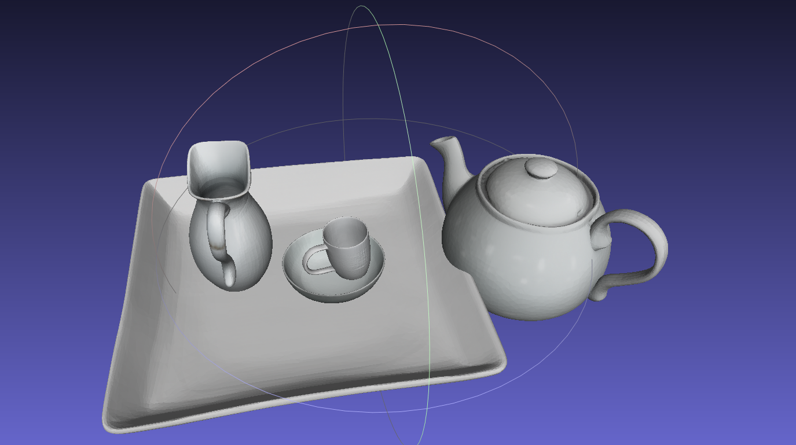
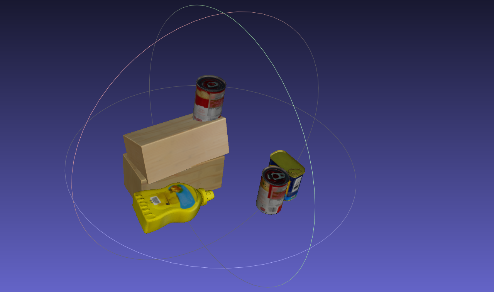

# physics-constrained-Real2Sim

## 📄 About This Repository

This is the official repository for the paper:

"Real-to-Sim for Highly Cluttered Environments via Physics-Consistent Inter-Object Reasoning"

[](https://arxiv.org/abs/2602.12633)
[](https://physics-constrained-real2sim.github.io/)


📄 **Paper:** https://arxiv.org/abs/2602.12633  
🌐 **Project Page:** https://physics-constrained-real2sim.github.io/


The project focuses on reconstructing **dynamically consistent 3D scenes** from a single RGB-D observation by explicitly modeling inter-object contact and physical constraints, enabling reliable simulation and contact-rich robotic interaction.

## 🚧 Status: Optimization Code Release

This repository is currently under active development.  

We have released our SAM3D+ICP initial guess and physics-constrained optimization. Evaluation codes realease is in preparation. 


```
git clone https://github.com/physics-constrained-Real2Sim/physics-constrained-Real2Sim.git
cd physics-constrained-Real2Sim
```

## Setup SAM3D-object initialization


We use **SAM3D** for **shape and pose initialization**. Running SAM3D requires an **NVIDIA GPU with at least 32GB of VRAM**. This README has been tested on an **A100 GPU with 40GB VRAM**.

If you do not have access to such hardware, you may **skip the SAM3D stage** and directly run our optimization framework using the **pre-inferred SAM3D objects** provided with this project.


```
cd physics-constrained-Real2Sim
git clone https://github.com/physics-constrained-Real2Sim/sam_3d_objects.git
cd sam_3d_objects
```

### 1. Setup Original SAM3D Python Environment


The following will install the default environment. If you use `conda` instead of `mamba`, replace its name in the first two lines. Note that you may have to build the environment on a compute node with GPU (e.g., you may get a `RuntimeError: Not compiled with GPU support` error when running certain parts of the code that use Pytorch3D).
 
```bash
# create sam3d-objects environment
mamba env create -f environments/default.yml
mamba activate sam3d-objects

# for pytorch/cuda dependencies
export PIP_EXTRA_INDEX_URL="https://pypi.ngc.nvidia.com https://download.pytorch.org/whl/cu121"

# install sam3d-objects and core dependencies
pip install -e '.[dev]'
pip install -e '.[p3d]' # pytorch3d dependency on pytorch is broken, this 2-step approach solves it

# for inference
export PIP_FIND_LINKS="https://nvidia-kaolin.s3.us-east-2.amazonaws.com/torch-2.5.1_cu121.html"
pip install -e '.[inference]'

# patch things that aren't yet in official pip packages
./patching/hydra # https://github.com/facebookresearch/hydra/pull/2863
```


### 2. Install diff-gaussian-rasterization

```
cd sam_3d_objects/diff-gaussian-rasterization
pip install .
```

### 3. Install [nvdiffrast](https://github.com/NVlabs/nvdiffrast)

```
pip install setuptools wheel ninja
pip install git+https://github.com/NVlabs/nvdiffrast.git --no-build-isolation
```

### 4. Getting Checkpoints


Due to the license, we can not directly proivde the checkpoint. Get the checkpoint via official SAM3D guidance: https://github.com/facebookresearch/sam-3d-objects/blob/main/doc/setup.md.

### 5. Run our scens

We provide two types of scenes in our dataset: **(1) Google Scanned Objects dataset** and **(2) YCB dataset**. Each scene represents a **static tabletop setup** composed of multiple rigid objects placed on a supporting surface. The objects exhibit **hierarchical inter-object relationships**, including **stacking, supporting, and leaning contacts**. All scenes are **manually constructed in the PyBullet simulator**.

Only a **limited subset of scenes** is included in this repository. If you require access to the **full dataset**, please contact the authors.


Reconstrut Google Scanned Dataset scenes: 
```
python run_scene_recon.py --dataset demo_google7 --transform google
```

Reconstrut YCB Dataset scenes: 
```
python run_scene_recon.py --dataset demo_ycb5 --transform YCB
```

It will generate meshes of all instances as ".obj" files and a "glb" file for whole scene visualization. If you open meshlab or other visualization tools. You should be able to see a scene below.





The scene is under highly floating and inter-penetration relation. The following optimization process will make the scene more physically plausible.

## Physics-constrained optimization

### Setup physics-constrained optimization


Our experiments in the paper is conducted on an **RTX 3080 GPU with 10GB VRAM**. This README has been tested on an **RTX 5080 GPU with 16GB VRAM**. The **minimum VRAM requirement** for running the optimization is **6GB**.

You may use different CUDA versions depending on your system configuration. However, we **strongly recommend using CUDA 12.1** to reproduce the exact results reported in the paper and to avoid potential `build-isolation` issues when installing the differentiable simulation dependencies.


```
conda create -n phyR2S python==3.9
conda activate phyR2S
```

```
conda install cuda -c nvidia/label/cuda-12.8.0
pip install torch==2.8.0 torchvision==0.23.0 torchaudio==2.8.0 --index-url https://download.pytorch.org/whl/cu128
```

### Install basic packages

```
pip install -r requirements.txt
```

If you encounter issues when running `pip install Py3ODE`, you may need to **build it from source** instead. The official Py3ODE repository can be found here:
[https://github.com/filipeabperes/Py3ODE](https://github.com/filipeabperes/Py3ODE)

Building Py3ODE from source is optional and may not be necessary in all environments.

**Build Py3ODE from source (optional):**

```
git clone https://github.com/filipeabperes/Py3ODE.git
cd Py3ODE
./install_ode.sh
```


### Build ev-sdf-utils

The default requirement for `ev-sdf-utils` is **CUDA 12.1**. However, the latest **RTX 5080 (Blackwell architecture)** is incompatible with builds using `build-isolation`.

If you have to use **Blackwell architecture** GPU, we recommend building `ev-sdf-utils` **from source**. Before building, make sure that **PyTorch**, **setuptools**, and **wheel** are already installed in your environment. Then run the installation **without build isolation**.


```
cd diffsdfsim
git clone https://github.com/EmbodiedVision/ev-sdf-utils.git
```

```
cd ev-sdf-utils
export PIP_NO_BUILD_ISOLATION=0 
export TORCH_CUDA_ARCH_LIST="8.6"
pip install -U pip setuptools wheel
pip install . --no-build-isolation
```

If you use `cuda==12.1`, you can directly install ev-sdf-utils without building from source. You might find more details at official website https://github.com/EmbodiedVision/ev-sdf-utils.

```
pip install git+https://github.com/EmbodiedVision/ev-sdf-utils.git
```

### Install pytorch3d

It might take a few minutes to build pytorch from source.
```
pip install "git+https://github.com/facebookresearch/pytorch3d.git"
```

### Install kaolin

We use kaolin for GPU-accelerated SDF calculation. Official website: https://kaolin.readthedocs.io/en/latest/notes/installation.html.

```
pip install kaolin==0.18.0 -f https://nvidia-kaolin.s3.us-east-2.amazonaws.com/torch-{TORCH_VER}_cu{CUDA_VER}.html ## Your cuda and pytorch version


pip install kaolin==0.18.0 -f https://nvidia-kaolin.s3.us-east-2.amazonaws.com/torch-2.8.0_cu128.html
```

### Run demo scens


#### 1. ICP registration

```
python ICP_refinement.py --dataset demo_google7
```
We enhance the pose prediction of SAM3D by ICP (Iterative Closest Point) registration algorithm. We use SAM3D+ICP as initial guess for following optimization.


#### 2. Run physics-constrained optimization

```
python main.py --dataset demo_google7 --debug --visualize # turn off visualize to speed up
```


The `main.py` script performs both **SDF-based geometry optimization** and **differentiable physics-based optimization**. It generates three output files: `initial_guess`, `geom_optim`, and `physics_optim`.

To visualize the scene graph and stage outputs, enable the `--debug` flag.

You can also visualize the rollout of the differentiable simulator by enabling the `--visualize` option. This will create a folder named `diff_worlds`, where objects are optimized sequentially according to the scene graph to achieve physically stable configurations.

Note that enabling visualization may increase computational cost due to rendering, which can slow down the optimization process.


### Evaluation scripts

Although we evaluate our scene optimization on `pybullet` simulator, it can be smoothly transfer to any general simulators. The meta result is saved at `physics_optim/result.json`. Evaluation codes is released in preparation.

### Trouble shootingt

1. Kernel error after building ev-sdf-utils. Modify `{your path}/ev-sdf-utils/setup.py` to manually set sm_120:

```
from setuptools import setup
from torch.utils.cpp_extension import BuildExtension, CUDAExtension

nvcc_args = [
    "-O3",
    "-gencode=arch=compute_120,code=sm_120",
    "-gencode=arch=compute_120,code=compute_120",  
]

setup(
    ext_modules=[
        CUDAExtension(
            name='ev_sdf_utils.cuda_sdf_utils',
            sources=[
                'src/cxx/cuda_sdf_utils.cpp',
                'src/cxx/marching_cubes.cu',
                'src/cxx/grid_interp.cu'
            ],
            extra_compile_args={'nvcc': nvcc_args},
        )
    ],
    cmdclass={'build_ext': BuildExtension}
)
```